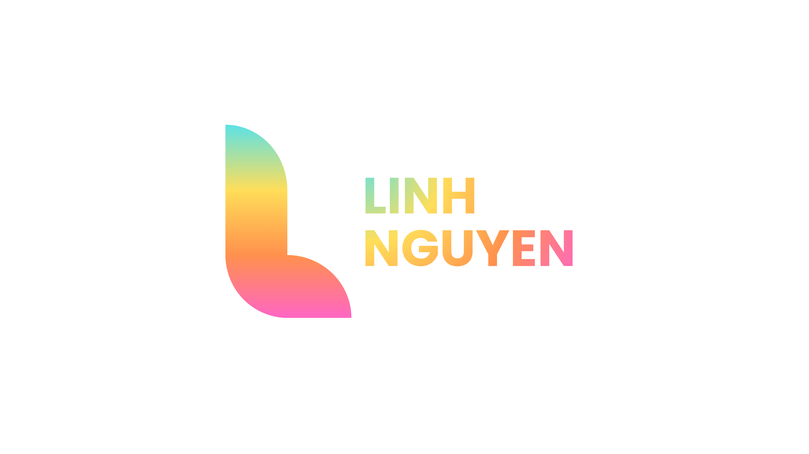

# The Portfolio of Linh Nguyen – Interactive Designer & Developer 🎨  



This repository contains the complete source code of my personal portfolio website — a fully custom-built experience showcasing my work in **web development**, **UI/UX**, **branding**, **motion graphics**, and **interactive media**.

The design focuses on **modern layouts**, **visual identity**, **motion-driven storytelling**, and **clean, scalable code architecture**.


---
## ✨ Overview

My portfolio is designed to express my identity as both a **designer** and **developer**, showcasing:

- A strong, consistent **visual style**
- Smooth, engaging **GSAP animations**
- Scalable and maintainable **SASS architecture**
- Custom JavaScript interactivity
- Fully responsive layouts

Each page blends design and technology to create an immersive and memorable experience.

---

## 🥷 Skills  

### **Core Areas**
- Front-End Development  
- Branding & Visual Design  
- UI/UX Interface Design  
- Motion & Interaction Design  

### **Tools & Technologies**
- **Languages:** HTML5, CSS3/SASS, JavaScript (ES6), PHP, MySQL  
- **Libraries / Frameworks:** GreenSock (GSAP), ScrollTrigger  
- **Design Tools:** Figma, Adobe Illustrator, After Effects, Photoshop  
- **Version Control:** Git + GitHub  

---

## 🛠 Tech Stack

### **Languages**
- HTML5  
- CSS3 / SASS  
- JavaScript (ES6+)  
- PHP  

### **Libraries & Tools**
- GSAP 3 (ScrollTrigger, TextPlugin)  
- Font Awesome 6  
- Git + GitHub  
- Figma  
- Adobe Illustrator  
- Adobe Photoshop  
- Adobe After Effects  

---

## 🎨 Design System

### Colors
- Primary Teal: #2E989C  
- Background Aqua: #D8FEFF  
- Pink Accent: #FF66C4  
- Yellow Accent: #FFDE59  
- Blue Accent: #5CE1E6  
- White: #FFFFFF  

### Typography
- Headings: Poppins  
- Body Text: Poppins  
- Accent Type: DynaPuff  
---

## 🚀 Features

### **1. Fully Responsive Design**
Custom grid system and breakpoint logic for all screen sizes: mobile, tablet, desktop.

### **2. Custom JavaScript Video Player**
A complete hand-coded video player featuring:
- Play / Pause  
- Replay  
- Timeline scrubbing  
- Volume scrubbing  
- Mute toggle  
- Fullscreen mode  
- Hover-based UI reveal  
- Auto timestamp formatting  

### **3. GSAP Animation System**
Smooth UI animations integrated across the site:
- Hero intro animations  
- Text typing effect  
- Scroll-triggered reveal animations  
- FAQ fade-in  
- Testimonials section animations  
- Flip card animations  
- Skill underline animations  
- Accent-letter bounce effect  
- Floating shapes animation  

### **4. Works Page Filter System**
Filter projects by category with animated GSAP transitions.

### **5. Testimonials Slider**
Lightweight transform-based carousel with next/previous navigation.

### **6. About Page Interactions**
- 3D flip cards  
- Avatar reveal animation  
- Skill rows with animated underline  
- Scroll-driven stagger animations  

### **7. PHP Contact Form**
- Input validation  
- Error highlighting  
- GSAP-powered shake animation  
- Success message animation  
- Auto-scroll to form on submit  
- URL cleanup after submission  

### **8. Text Marquee (Ticker)**
Looped scrolling text with pause-on-hover functionality.
---

## 🧠 Interactive JavaScript Systems

### **Typing Text Engine**
Cycles through multiple job roles using GSAP’s TextPlugin.

### **Reusable Scroll Reveal Function**
```js
function fadeUpOnScroll(targets) {
  gsap.utils.toArray(targets).forEach(el => {
    gsap.from(el, {
      opacity: 0,
      y: 40,
      duration: 1,
      ease: "power2.out",
      scrollTrigger: {
        trigger: el,
        start: "top 90%",
        toggleActions: "play reverse play reverse"
      }
    });
  });
}
```

### **Dynamic Typing Engine**
Rotates job titles in the hero section using GSAP TextPlugin:
```js
const roles = ["Graphic Designer", "Web Developer", "Motion Designer", "Project Manager"];
let roleIndex = 0;

function typeRole(value) {
  return gsap.to(roleText, { text: value, duration: 1.2, ease: "power2.out" });
}
```
This creates a continuously looping typing effect.

### **Reusable ScrollReveal Animation System**
Universal GSAP fade-up animation applied across all pages:
```js
function fadeUpOnScroll(targets) {
  gsap.utils.toArray(targets).forEach(el => {
    gsap.from(el, {
      opacity: 0,
      y: 40,
      duration: 1,
      ease: "power2.out",
      scrollTrigger: {
        trigger: el,
        start: "top 90%",
        toggleActions: "play reverse play reverse"
      }
    });
  });
}
```
Used on:
- Section titles
- Descriptions
- Images
- Grid content
- Case study blocks

### **Floating Shapes Animation Engine**
Adds depth and motion to the Works page using random GSAP motion paths:

```js
gsap.to(shape, {
  x: "+=" + gsap.utils.random(-40, 40),
  y: "+=" + gsap.utils.random(-40, 40),
  duration: gsap.utils.random(4, 7),
  repeat: -1,
  yoyo: true,
  ease: "sine.inOut"
});
```
Different shape colors have special behaviors (e.g., extended movement for blue shapes, vertical oscillation for yellow shapes).

### **Flip Card Interaction System**
Interactive 3D flip cards in the About page:
```js
function handleCardClick(event) {
  const card = event.currentTarget;
  const flipped = card.classList.contains("is-flipped");

  gsap.to(card, {
    rotateY: flipped ? 0 : 180,
    duration: 0.8,
    ease: "power2.inOut"
  });

  card.classList.toggle("is-flipped");
}
```
### **Skills Section Line Animation**
Each skill row animates:
- Fade-in
- Text slide-in
- Underline expansion via CSS variable
```js
tl.to(row, {
  "--lineWidth": "100%",
  duration: 0.9,
  ease: "power2.out"
});
```
### **Marquee Loop System**
Infinite horizontal scrolling text with pause-on-hover:
```js
const anim = gsap.to(group, {
  x: "-100%",
  repeat: -1,
  duration: duration,
  ease: "linear"
});
```
Hover pauses all animations.

### **Works Filter System**
Filters displayed projects by category:
```js
function handleFilterClick(event) {
  const selected = event.currentTarget.getAttribute("data-filter");

  allCards.forEach(card => {
    const isVisible = selected === "all" || card.dataset.category.includes(selected);

    if (isVisible) {
      card.style.display = "block";
      gsap.fromTo(card, { opacity: 0 }, { opacity: 1, duration: 0.3 });
    } else {
      gsap.to(card, {
        opacity: 0,
        duration: 0.2,
        onComplete: () => (card.style.display = "none")
      });
    }
  });
}
```
### **Testimonials Carousel System**
Lightweight transform-based slider:
```js
function updateCarousel() {
  sliderWrapper.style.transform = `translateX(${currentIndex * -100}%)`;
}
```
Supports:
- Infinite looping
- Next / Previous navigation
- GSAP reveal animations

### **Form Interaction, Validation & Feedback System**
Includes:
- GSAP shake animation for invalid fields
- Auto-scroll to form after submission
- Inline error messages
- Success message animation
- URL cleanup - (?from=submit removed after load)
- Shake animation sample:
```js
gsap.from(field, {
  x: -8,
  duration: 0.1,
  yoyo: true,
  repeat: 3,
  ease: "power1.inOut"
});
```
### **Letter-Split Accent Animation**
Used in Contact page hero:
```js
gsap.from("#contact-hero .letter", {
  opacity: 0,
  y: 20,
  stagger: 0.05,
  duration: 0.7,
  ease: "power2.out"
});
```
Accent letters bounce on hover.

## 📄 Page Structure

The portfolio is organized into multiple pages, each designed with a specific purpose.  
Every page includes carefully structured content, responsive layout, and GSAP-powered animations.

---

### 🏠 Home Page (`index.html`)

The homepage introduces visitors to the portfolio and includes:

- **Hero Section**
  - Animated headline  
  - Rotating role text (typing effect)  
  - Decorative elements with soft motion  

- **Introduction Section**
  - Brief personal overview  
  - Supporting visuals with scroll-triggered animations  

- **Video Reel Section**
  - Custom JavaScript video player  
  - Auto-hide controls, scrubbing, fullscreen, replay  

- **Featured Works Preview**
  - Showcase grid with fade-up animations  
  - Each card links to a full case study  

- **Testimonials Section**
  - Custom slider (Next/Prev)  
  - GSAP fade-in for each card  

- **Footer**
  - Social links  
  - Navigation  
  - Clean layout and color consistency  


---

### 🧰 Works Page (`works.html`)

A categorized portfolio gallery with interactive filtering and animated visuals.

- **Hero Banner**
  - Animated heading + intro text  
  - Subtle entry transitions  

- **Category Filter System**
  - "All / Web / Motion / Branding"  
  - Active state highlight  
  - GSAP fade transitions for showing/hiding cards  

- **Work Cards Grid**
  - Responsive layout  
  - Fade-in animation per card  
  - Each card links to a corresponding case study page  

- **Floating Decorative Shapes**
  - Random GSAP motion  
  - Layered for depth and visual flair  

---
### 👤 About Page (`about.html`)

A personality-focused page introducing the designer behind the work.  
Features include:

- **Animated Hero Titles**
  - Staggered text transitions  
  - Supporting hint animation  

- **Avatar Reveal**
  - Smooth slide/fade animation on scroll  

- **Flip Cards**
  - Interactive 3D GSAP rotation  
  - Display fun facts and personal traits  

- **Skill Sections**
  - Skill titles, descriptions  
  - Underline animation driven by CSS variables + GSAP  
  - Staggered fade-up on scroll  

- **Supporting Text Blocks**
  - Clean spacing and responsive readability  
---

### 📄 Case Study Pages (`case_studies/*.html`)

Each project includes its own case study page with an in-depth breakdown:

- **Project Hero Section**
  - Animated title and hero image  
  - Scroll-trigger reveal  

- **Description Block**
  - Project summary and role explanation  
  - GSAP fade-up text  

- **Detail Section**
  - Image galleries or process visuals  
  - Animated entry for each visual element  

- **Project Information Grid**
  - Tools used  
  - Responsibilities  
  - Outcomes and design goals  

- **More Projects Slider**
  - Horizontal scroll/slider layout  
  - Encourages further exploration  

---

### ✉️ Contact Page (`contact.php`)

A fully interactive contact system, built with PHP validation and GSAP motion.

- **Hero Section**
  - Split-letter animation  
  - Accent bounce interaction  
  - Supporting text reveal  

- **Contact Form**
  - Name, Email, Message fields  
  - PHP validation  
  - Error messages and GSAP shake animation  
  - Success message animation  
  - Auto-scroll to form after submission  
  - URL cleanup script  

- **FAQ Section**
  - Individually animated FAQ rows  
  - Fade-up scroll interactions  

---

### 🧭 Header & Navigation (Global)

Included across all pages:

- Responsive grid-based header  
- Desktop navigation  
- Mobile hamburger menu  
- Active link state highlight  
- Smooth animation on interaction  

---

### 🦶 Footer (Global)

Shared across all pages, containing:

- Social media icons  
- Quick navigation links  
- Copyright  
- Consistent branding and color palette  

---
## 📁 File Structure

- css/ – compiled CSS files (main.css, grid.css)
- images/ – all images used on the website
- includes/ – send.php
- js/ – JavaScript files (main.js, works.js, about.js, casestudy.js, connect.js)
- sass/ – full SASS source using the 7–1 architecture
- video/ – portfolio video reel and media assets

- .gitignore
- LICENSE
- README.md

- about.html  
  → Page introducing who I am, my background, skills, and interactive flip cards.

- connect.php  
  → Contact page with PHP form processing, GSAP validation, and FAQ interactions.

- elin_project.html  
  → Case study page for the **Elin** branding/design project.

- index.html  
  → Homepage featuring hero section, intro, video reel, featured works, and testimonials.

- industrynight_project.html  
  → Case study page for the **Industry Night** design/interactive project.

- swan_project.html  
  → Case study page for the **Swan Earbuds** 3D/motion design project.

- swerve_project.html  
  → Case study page for the **Swerve Drinks** motion & branding project.

- works.html  
  → Portfolio gallery page with filter system (All / Web / Motion / Branding).

  ---

## 💻 Installation

To run this portfolio locally, follow the steps below:

### 1. Clone the repository
git clone https://github.com/RosesNguyen2911/Nguyen_Linh_Portfolio.git

### 2. Move the project into your local server directory

For MAMP (macOS):
/Applications/MAMP/htdocs/

For XAMPP (Windows):
C:/xampp/htdocs/

### 3. Start your local server (MAMP or XAMPP)

Then open the project in your browser:

MAMP:
http://localhost:8888/Nguyen_Linh_Portfolio/index.html

XAMPP:
http://localhost/Nguyen_Linh_Portfolio/index.html

### 4. Enable PHP
Required for the contact form (connect.php) to work properly.

### 5. Done!
You can now explore the full portfolio locally, including animations, case studies, and the PHP contact form.

---
## 🔗 Live Demo
(Coming soon)

---
## 📄 License
- This project is licensed under the MIT License.  
- You may use parts of the code for learning or inspiration, but please provide credit when appropriate.
---

## ✅ Credits

This project was designed and developed by **Linh Nguyen**.

The following tools and libraries were used to enhance the visual experience, animations, and functionality:

- **GSAP 3** – animation engine  
- **ScrollTrigger** – scroll-based animations  
- **GSAP TextPlugin** – typing and text morph effects  
- **Font Awesome 6** – icons  
- **Google Fonts** – Poppins & DynaPuff typography  
- **PHP** – contact form processing  
- **GitHub** – version control and project hosting

 - ***All design elements, motion graphics, UI layouts, illustrations, and case studies were fully created by Linh Nguyen***.
 ---


